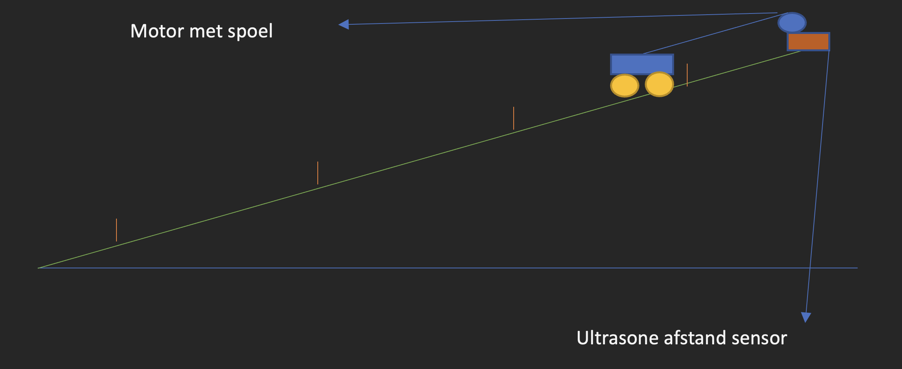

# Lift met arduino

#Eerste kod is gemaakt met debounce en apart vier button.

#Tweede kod is gemaakt met vier button die maar alleen een signaal geven.

___

### Detail:

Het doel van de project is om een karretje dat op een helling staat, met behulp van een elektromotor en afstand sensor van het ene markeringspunt naar het andere markeringspunt te laten bewegen.

Naar welk markeringspunt het karretje moet bewegen wordt bepaald met een drukknop. De markeringspunten zijn weergegeven op de helling (in de afbeelding de rode streepjes)

Het karretje gaat bewegen zodra een van de drukknop,  wordt losgelaten.

Op een lcd-display is zichtbaar wat het karretje aan het doen is in woorden en de gemeten waarde door de afstand sensor.

Het karretje mag niet opeens van richting veranderen als het al naar een ander punt aan het bewegen is.

